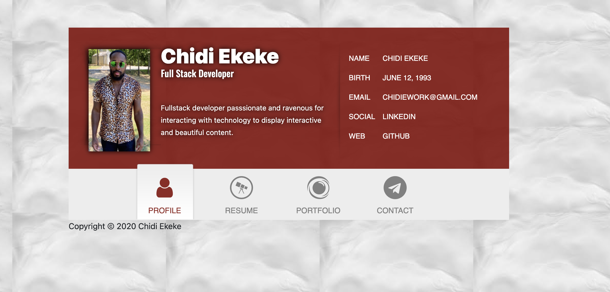

# Porfolio
## Description
This is Javascript phenomenom based application is intended to highlight my accomplishments as a developer and show off passion for developing., and discover new and exciting games. This Javacript based application includes information about myself, my resume, links to get to my pinned projects and bouncing animations so enjoy the fun.

## Table of Contents

* [Features](#Features)
* [Links](#Links)
* [Application-Preview](#Application-Preview)
* [Technologies](#Technologies)
* [Reference](#Reference)
* [Credits](#Credits)
* [Contributors](#Contributors)
* [License](#License)

## Features 
Main Features:

* A fully functional home page that allows users to navigate to other parts of the website
## Links

* Project Repo: [Repository](https://github.com/chidibangzz/updated-portfolio)
* Deployed Project Repo: [Website](https://chidibangzz.github.io/updated-portfolio/)

## Application-Preview

## Technologies

* Javascript
* HTML
* CSS
* [Boostrap](https://getbootstrap.com/)
* [NodeJS](https://nodejs.dev/)

## References

These are the websites we used as references: 

> - [StackOverflow](https://www.stackoverflow.com/) || Most issues we had were resolved from looking at other people's problems.

How to create a good README here: 
> - [GitHub Docs](https://docs.github.com/en/free-pro-team@latest/github/writing-on-github/basic-writing-and-formatting-syntax) || Learned most of my README syntax here.
> - [Akash Nimare](https://medium.com/@meakaakka/a-beginners-guide-to-writing-a-kickass-readme-7ac01da88ab3) || Based my README from his guide.
> - [Mark Down Guide](https://www.markdownguide.org/cheat-sheet/) || README Syntax

## Credits

> - [Porfolio-ideas](https://www.squarespace.com/websites/create-a-portfolio/?channel=pnb&subchannel=go&campaign=pnb-dr-go-us-en-verticals-bmm&subcampaign=(verticals-portfolio_portfolio_bmm)&utm_source=google&utm_medium=pnb&utm_campaign=pnb-dr-go-us-en-verticals-bmm&utm_term=%2Bportfolio&gclid=CjwKCAjwhMmEBhBwEiwAXwFoEYxoze8JY0TXTi4Yq1W9bgg4DV10wdEpTmQpEm8mUJ0b5iRvK_RWahoCalQQAvD_BwE) || Ideas for Porfolio

## License

MIT © [Chidi Ekeke](https://github.com/chidibangzz)

